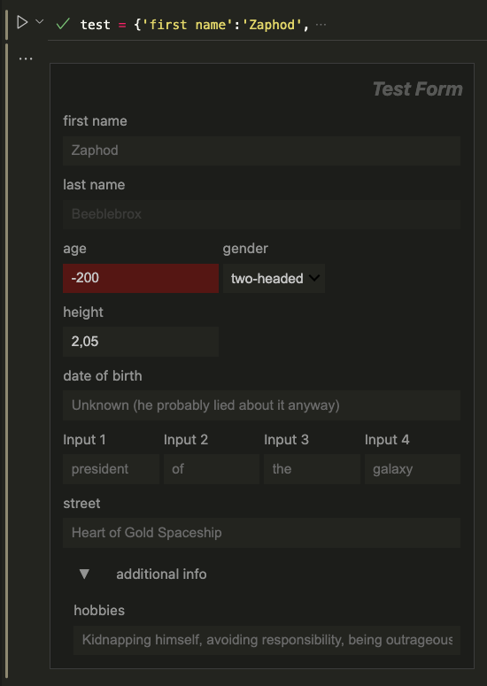

# IpyFormKit

IpyFormKit is a Python library for creating dynamic, interactive forms using `ipywidgets` in Jupyter notebooks. It simplifies the process of building forms for data entry, configuration, or experimentation with minimal code.

## Features

- **Dynamic Forms**: Automatically generate forms from dictionaries with support for various input types (text, numbers, dropdowns, checkboxes, etc.).
- **Custom Widgets**: Includes specialized widgets like `FileAutocomplete` for file selection and `CollapsibleVBox` for collapsible sections.
- **Validation and Logic**: Add conditions to disable, hide, or validate fields dynamically based on user input.
- **Masonry Layout**: Organize multiple forms in a responsive masonry-style layout.

